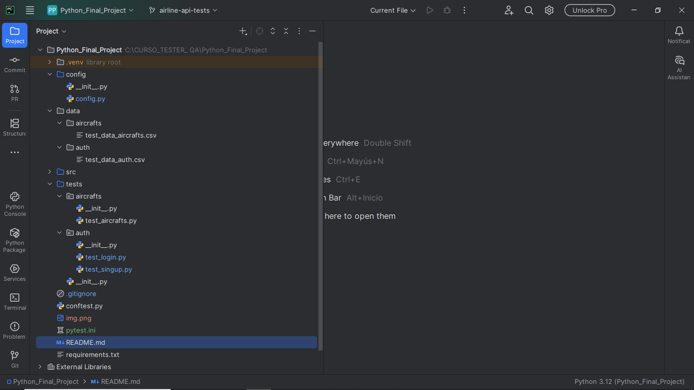

## Autor
Adriana L. Loretán

# Python Final Project - QA Testing
<!-- Indicadores  - badges que aparecen al inicio -->

## Descripción
Proyecto de pruebas automatizadas en Python para validar funcionalidades de autenticación (`login` y `signup`) de una aplicación web ficticia.  
Se utilizan `pytest` y buenas prácticas de testing para asegurar la calidad del software.

## Tecnologías
- Python 3.12
- Pytest 8.4.1
- Virtual environment (`venv`)
<!-- NO USADO AÚN - Plugins: `anyio-4.10.0` <Plugin para testing asíncrono (async/await) -->

## Estructura del proyecto

## Instalación 
1. Clonar el repositorio: 
git clone <URL_DEL_REPOSITORIO>

2. Crear e ingresar al entorno virtual:
python -m venv .venv
.\.venv\Scripts\activate

3. Instalar dependencias:
pip install -r requirements.txt

## Ejecución de tests
Para correr todos los tests:

pytest

## Resultado esperado

collected 7 items

tests/auth/test_login.py::test_login_success_and_validate_me PASSED
tests/auth/test_login.py::test_login_with_wrong_password PASSED
tests/auth/test_login.py::test_login_non_existing_user PASSED
tests/auth/test_login.py::test_login_invalid_payload PASSED
tests/auth/test_singup.py::test_signup_successful PASSED
tests/auth/test_singup.py::test_signup_existing_user PASSED
tests/auth/test_singup.py::test_signup_with_invalid_email PASSED

7 passed in 17.26s
